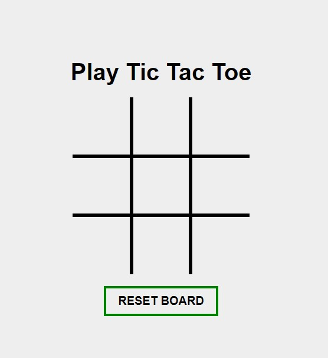

# Tic Tac Toe Game

### About the project
Project made for VueJs Course on start2Impact, it's a simple tic tac toe game. 
### Getting started
To get a local copy up and running follow these simple steps. You can also try a live demo on [Netlify](https://upbeat-golick-4e318a.netlify.app) 
### Prerequisites
- [NodeJS](https://nodejs.org/en/)

### Installation
Download source and open a command prompt in its folder and run the following code.
`npm install`
`npm run serve`
Navigate to `http://localhost:8080`. The app will automatically reload if you change any of the source files.

### Acknowledgements

- [VueJs](https://vuejs.org)
- [VueJs composion API](https://v3.vuejs.org/guide/composition-api-introduction.html#why-composition-api)
